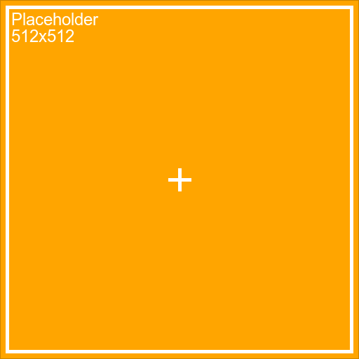

# imggen

A shell script to create simple placeholder images, like you might use for textures. Requires [ImageMagick](https://www.imagemagick.org/script/index.php), which you can get via [brew](https://brew.sh):

```
brew install imagemagick
```

You can then invoke the `imggen` file as described below. I'd recommend symlinking this to `/usr/local/bin`:
```
ln -s /path/to/original/imggen /usr/local/bin/imggen
```

# Usage

Create an image with 1024x512 resolution and save it as `some_image.png`.
```
imggen -s 1024x512 -o some_image
```

Shorthand to create a square image and save it as `out.png`.
```
imggen 256
```

Additional settings:
```
Usage: imggen [-s 256x512] [-o 10] [-p 16] [-sw 4] [-fs 24]
              [-fg white] [-bg orange] [-f Arial] [-t Placeholder]
              [-out out]
       imggen 256

Options:
  -h   --help          Print this help info and exit
  -s   --size          Set to width x height of desired output
  -o   --offset        Distance from inner box to edge of image
  -p   --plus          Width and height of center indicator
  -sw  --stroke-width  Width of stroke of all lines
  -fs  --font-size     Size of font
  -fg  --foreground    Color of text, square, center indicator
  -bg  --background    Color of background
  -f   --font          Name of font to use for text
  -t   --text          String to display over size information
  -out --out-file      Name of output file (no extension)
```

# Output



# Todo

* Make this available via Homebrew with dependencies.
* Better font size handling.
* (Optionally?) names files with suffix of dimensions.

# License

&copy; 2017 [Steve Richey](https://github.com/steverichey). Shared under an [MIT license](https://en.wikipedia.org/wiki/MIT_License). See [license.md](./license.md) for details.
